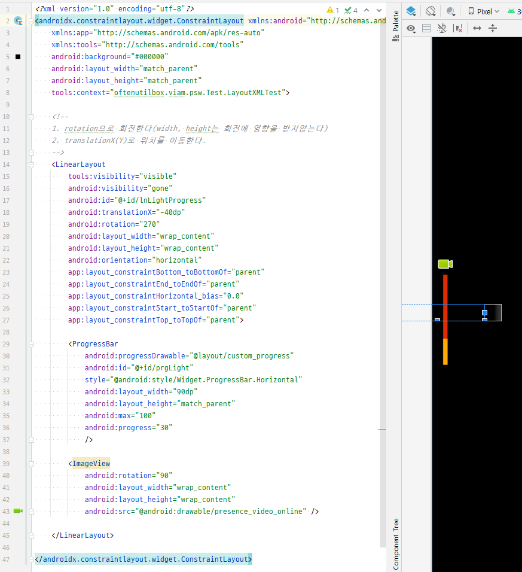

### View Rotation
> Android에서는 View를 Rotation하며 세로 Progressive를 구현할 때가 많다.

1. rotation으로 회전한다(width, height는 회전에 영향을 받지않는다)
2. translationX(Y)로 위치를 이동한다.

- example_2.xml
~~~xml
<?xml version="1.0" encoding="utf-8"?>
<androidx.constraintlayout.widget.ConstraintLayout xmlns:android="http://schemas.android.com/apk/res/android"
    xmlns:app="http://schemas.android.com/apk/res-auto"
    xmlns:tools="http://schemas.android.com/tools"
    android:background="#000000"
    android:layout_width="match_parent"
    android:layout_height="match_parent"
    tools:context="oftenutilbox.viam.psw.Test.LayoutXMLTest">

    <!--
    1. rotation으로 회전한다(width, height는 회전에 영향을 받지않는다)
    2. translationX(Y)로 위치를 이동한다.
    -->
    <LinearLayout
        tools:visibility="visible"
        android:visibility="gone"
        android:id="@+id/lnLightProgress"
        android:translationX="-40dp"
        android:rotation="270"
        android:layout_width="wrap_content"
        android:layout_height="wrap_content"
        android:orientation="horizontal"
        app:layout_constraintBottom_toBottomOf="parent"
        app:layout_constraintEnd_toEndOf="parent"
        app:layout_constraintHorizontal_bias="0.0"
        app:layout_constraintStart_toStartOf="parent"
        app:layout_constraintTop_toTopOf="parent">

        <ProgressBar
            android:progressDrawable="@layout/custom_progress"
            android:id="@+id/prgLight"
            style="@android:style/Widget.ProgressBar.Horizontal"
            android:layout_width="90dp"
            android:layout_height="match_parent"
            android:max="100"
            android:progress="30"
            />

        <ImageView
            android:rotation="90"
            android:layout_width="wrap_content"
            android:layout_height="wrap_content"
            android:src="@android:drawable/presence_video_online" />

    </LinearLayout>

</androidx.constraintlayout.widget.ConstraintLayout>
~~~

- custom_progress.xml
~~~xml
<?xml version="1.0" encoding="utf-8"?>

<layer-list xmlns:android="http://schemas.android.com/apk/res/android">
    <item android:id="@android:id/background">
        <shape android:shape="line">
            <stroke android:width="4dp" android:color="#DD2C00" />
        </shape>
    </item>

    <item android:id="@android:id/secondaryProgress">
        <clip>
            <shape android:shape="line">
                <stroke android:width="4dp" android:color="#FF6D00" />
            </shape>
        </clip>
    </item>

    <item android:id="@android:id/progress" >
        <clip>
            <shape android:shape="line">
                <stroke android:width="4dp" android:color="#FFAB00" />
            </shape>
        </clip>
    </item>

</layer-list>
~~~